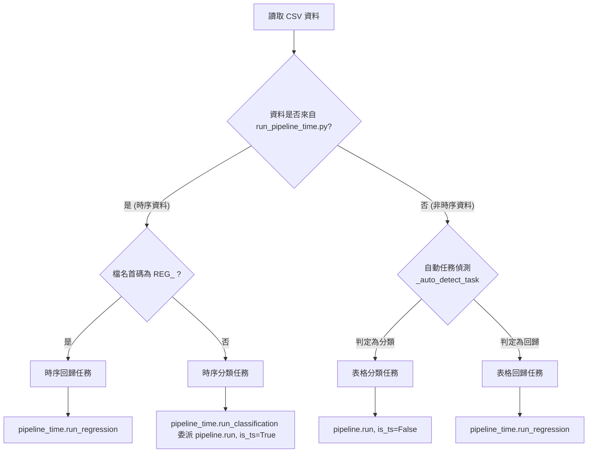
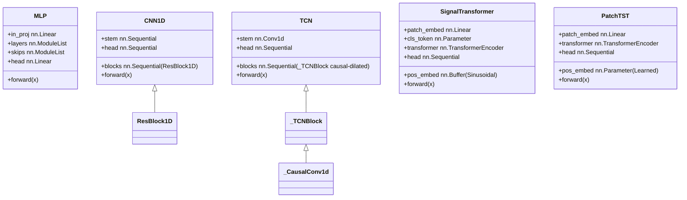
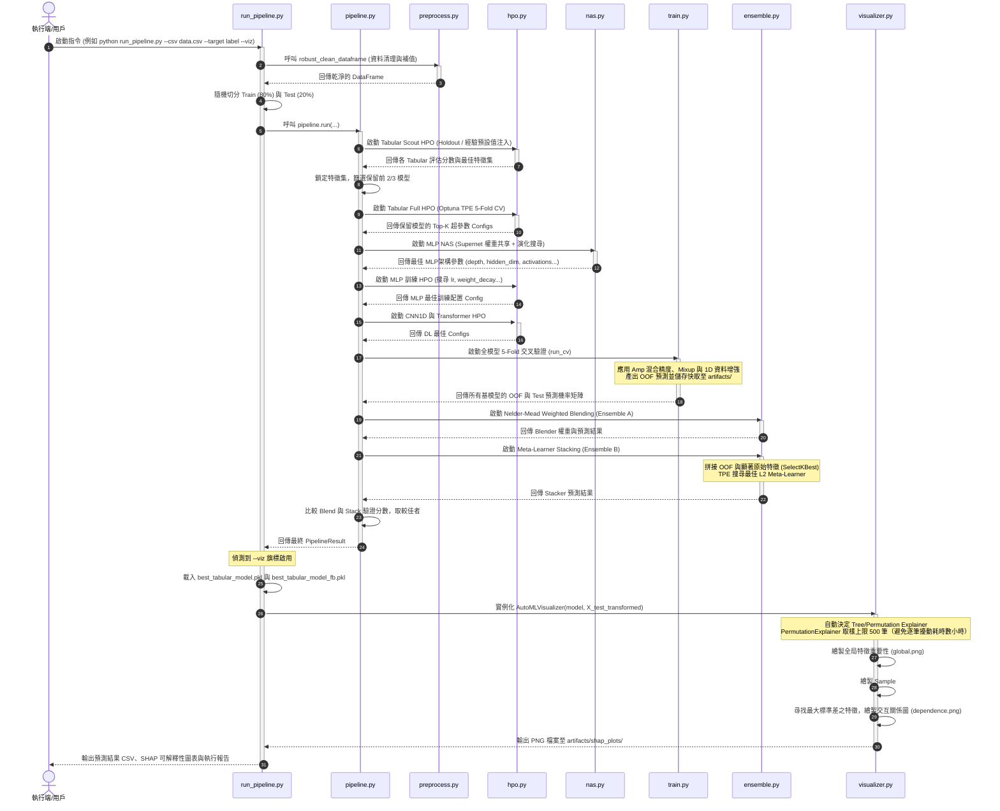

# AutoML 系統架構設計

本文件詳細描述了本專案中 AutoML Pipeline 的整體系統架構、執行流程、模組設計以及核心演算法。

本系統是一個高度自動化的機器學習與深度學習流程引擎，專為**非時序資料（表格分類/回歸）**及**時序資料（時間序列分類/回歸）**所設計。它整合了特徵工程、超參數優化（HPO）、神經架構搜尋（NAS）、交叉驗證（CV）與多重集成學習（Ensemble）等技術，並支援自適應時間預算限制。

---

## 1. 系統架構與目錄結構

整個 AutoML 系統的原始碼位於 `src/` 目錄，並由根目錄的幾個執行腳本驅動：

```
人工智慧project/
├── run_pipeline.py         # 執行入口（非時序：表格分類 + 表格回歸）
├── run_pipeline_time.py    # 執行入口（時序：時序分類 + 時序回歸，支援 --new-ts-batch）
├── run_baseline.py         # AutoGluon 對照組（分類 + 回歸）
├── generate_shap.py        # 從現有 artifacts 直接產生 SHAP 圖（不重新訓練）
├── merge_final_results.py  # 批次結果合併工具
├── scripts/                # 資料集收集與下載指令稿
│   ├── data_collect.py     # 下載 OpenML-CC18 表格分類資料集
│   ├── data_collect_reg.py # 下載 OpenML 回歸資料集
│   └── data_collect_time.py# 下載 UCR 時序資料集
├── src/
│   ├── __init__.py
│   ├── pipeline.py         # 通用 Pipeline 引擎（分類 HPO/NAS/CV/Ensemble）
│   ├── pipeline_time.py    # 時序專用 Pipeline 引擎（分類委派，回歸獨立）
│   ├── config.py           # 全域配置（DEVICE, SEED, ARTIFACTS_DIR）
│   ├── data.py             # 資料集定義（TabularDataset）與 CV 劃分（get_folds, get_ts_folds）
│   ├── metrics.py          # 評估指標計算（Macro F1, Accuracy, RMSE, R² 等）
│   ├── preprocess.py       # 特徵工程引擎（FeatureBuilder 10 種特徵集, TSFeatureBuilder, robust_clean_dataframe）
│   ├── hpo.py              # 超參數優化（TabularHPO, DLHPO 2-fold, MLPTrainHPO, TSNetTrainHPO）
│   ├── nas.py              # 神經架構搜尋（MLPNASSearcher, TSNASSearcher）
│   ├── train.py            # 交叉驗證訓練器（run_cv, 混合精度 AMP, 數據增強）
│   ├── ensemble.py         # 集成學習器（NelderMeadBlender, MetaLearnerStacker）
│   ├── best_presets.json   # 黃金預設超參數（各模型最佳設定）
│   └── models/             # 深度學習與傳統模型定義
│       ├── __init__.py
│       ├── tabular.py      # 傳統 Tabular 模型工廠（LGBM, XGB, CatBoost, RF, LogReg 等）
│       ├── mlp.py          # 可配置 MLP（層數/寬度/激活/殘差/Dropout 均可調）
│       ├── cnn1d.py        # 一維卷積（CNN1D, ResNet1D_18, 因果擴張 TCN）
│       └── transformer.py  # 自注意力網路（SignalTransformer Sinusoidal PE, 時序 SOTA PatchTST）
├── preprocessing/          # 雙軌前處理模組（樹模型軌 + 深度學習軌）
│   ├── interface.py        # preprocess_for_training()：統一呼叫入口
│   │                       #   回傳 (X_dict_tr, X_dict_te, y_tr, y_te, _)
│   │                       #   X_dict 含 "tree"（OrdinalEncoder）與 "dl"（OHE）兩軌
│   ├── data_loader.py      # 資料載入與型別解析
│   ├── core/
│   │   ├── router.py       # 欄位型別路由（數值/類別/文字/時序/影像）
│   │   ├── assembler.py    # 兩軌特徵組裝（樹軌：OrdinalEncoder+稀有類別分組；DL 軌：OneHotEncoder）
│   │   └── ts_preprocessor.py  # TSDataProcessor：時序專用前處理（排序/ffill/週期特徵/類別編碼）
│   ├── processors/         # 各型別處理器
│   │   ├── numeric_processor.py    # 數值：缺失填補、RareCategoryGrouper、StandardScaler
│   │   ├── category_processor.py  # 類別：OrdinalEncoder / OHE，稀有類別 → "__rare__"
│   │   ├── text_processor.py      # 文字：TF-IDF 截斷
│   │   ├── time_processor.py      # 時間：datetime 解析 → 年/月/星期/天
│   │   ├── image_processor.py     # 影像（預留介面）
│   │   └── feature_generator.py   # 跨型別衍生特徵生成（包含 MIFeatureSelector 與 RobustDataCleaner 盾牌）
│   └── utils/
│       ├── custom_transformers.py # 自訂 sklearn-compatible 轉換器
│       ├── data_health.py         # 資料健康度診斷（缺失率、偏度、離群值）
│       ├── memory_optimizer.py    # dtype 壓縮（int8/float32 降記憶體）
│       ├── adversarial.py         # 對抗驗證（AUC > 0.85 自動移除漂移特徵）
│       └── adversarial_help.py    # 對抗驗證輔助函式
├── visualization/          # SHAP 視覺化與測試模組
│   ├── visualizer.py       # AutoMLVisualizer：SHAP 視覺化（TreeExplainer 精確解 / PermutationExplainer 最多 500 筆，輸出高畫質 PNG）
│   ├── test_generality.py  # IBM HR 員工離職與房價預測的通用性測試
│   ├── test_nn.py          # SklearnWrapper 類別：驗證 PyTorch MLP 神經網路的 SHAP
│   ├── test_timeseries.py  # ETTh1 電力數據時序回歸的視覺化測試
│   └── test_diabetes.py    # 糖尿病資料集的 SHAP 視覺化測試
└── test/                   # 測試與驗證資料夾
    └── dataset.csv         # 測試用資料集
```

---

## 2. 執行入口與任務判定

系統設計了兩個核心入口腳本，負責讀取資料、自動判定任務類型，並將資料切分後分流至相應的 Pipeline 引擎：



### 2.1 任務判定邏輯
在 `run_pipeline.py` 中，系統會透過 `_auto_detect_task(y)` 函數自動識別任務類型：
- 若目標欄位的資料型態為 `object` 或 `bool`，判定為 **分類（classification）**。
- 若為數值型態，且相異值個數（Nunique） $\le 50$ 且相異值佔樣本數比例 $< 30\%$，判定為 **分類**。
- 否則判定為 **回歸（regression）**。

### 2.2 目標欄偵測
如果未手動指定目標欄位，系統會依序檢查以下名稱：`target` $\rightarrow$ `label` $\rightarrow$ `class` $\rightarrow$ `y` $\rightarrow$ `c`，若皆未匹配，則拋出 `ValueError` 並提示可用欄位，請以 `--target` 明確指定目標欄位名稱。

### 2.3 資料切分與驗證模式
- **非時序分類**：預設進行 `80/20` 的 **分層隨機切分（Stratified Split）**。
- **非時序回歸**：預設進行 `80/20` 的 **隨機切分（Random Split）**。
- **時序分類**：UCR 時序分類樣本視為獨立，採用 **分層隨機切分**（與非時序分類一致）。
- **時序回歸**：嚴格採用 **時序順序切分（Chronological Split）**，將時間順序上最後 20% 的資料做為測試集，嚴禁 Shuffle，杜絕未來資訊洩漏。

---

## 3. 特徵工程與雙軌前處理

本系統具有強健的特徵處理與前處理管線，由兩個主要部分協同運作：
- **`preprocessing/`**：全域雙軌前處理模組，負責資料的基礎清理、型別路由、特徵選擇、缺失值與異常值處理，並支援自動衍生特徵生成（如群組聚合、多項式交互、偏態矯正）。
- **`src/preprocess.py`**：在雙軌前處理輸出的基礎上，於交叉驗證（CV）各折疊中進行折疊隔離（Fold-isolated）的 10 種模型特徵集（FeatureBuilder）與時序滯後特徵（TSFeatureBuilder）提取，防範標籤洩漏（Target Leakage）。

### 3.1 雙軌前處理架構（`preprocessing/interface.py`）

`preprocess_for_training(df, target_col, test_size=0.2)` 是統一呼叫入口，採用**中控樞紐模式**與**雙軌分流機制**，回傳包含樹軌與深度學習軌的特徵字典 `{"tree": ..., "dl": ...}`：

| 軌道類型 | 編碼與前處理策略 | 特徵選擇與限制 | 適用模型 |
| :--- | :--- | :--- | :--- |
| **Tree 軌（生肉）** | 保留 NaN、不縮放。<br>類別型別使用 `OrdinalEncoder`（未知與缺失填補為 `-1`）。 | 套用 `MIFeatureSelector`<br>保留重要性前 **800** 個特徵。 | LGBM / XGB / CatBoost / RF / ExtraTrees / KNN 等 |
| **DL 軌（熟肉）** | 使用 `SimpleImputer`（中位數）/ MICE `IterativeImputer` 補值。<br>使用 `StandardScaler` 標準化。<br>低基數類別使用 `OneHotEncoder` 展開（合併稀有類別）。 | 套用 `MIFeatureSelector`<br>嚴格保留前 **300** 個特徵。 | MLP / CNN1D / ResNet1D / TCN / Transformer / PatchTST 等 |

#### 3.1.1 記憶體與效能極限優化
- **探路優化**：為防大數據在 `AutoRouter` 擬合時記憶體爆炸，系統在 `fit` 階段僅隨機抽樣 **5,000 筆** 訓練資料，經 `RobustDataCleaner` 清理後供 `AutoRouter` 進行型別掃描，隨後立即釋放抽樣暫存，節省 90% 的記憶體。
- **覆蓋賦值（Reassignment）**：全域清理過程使用覆蓋賦值，利用 Pandas 內部區塊共享機制（Block Sharing），避免大表複製（`.copy()`），減少記憶體翻倍風險。

#### 3.1.2 智慧特徵煉金術（`assembler.py` ＆ `feature_generator.py`）
前處理管線中會自動偵測並注入三種進階特徵生成器：
1. **自動群組聚合統計 (Grouped Aggregation)**：自動尋找含有 ID 語意的類別欄（如包含 card, addr, product 等）及數值欄（如 amt, dist），計算分組 `mean` 與 `std`。內建 **出現次數門檻篩選**（`min_samples=10`），且在推論期遇到未見過 ID 時自動 fallback 至全域統計值，防範 NaN 擴散。
2. **自動多項式交互特徵 (Polynomial Interactions)**：選取變異數最大的 Top-3 數值特徵進行兩兩交叉乘除。內建 **除以零防爆裝甲**（Epsilon Smoothing，除數增加 `+ 1e-5`），防範產生 `inf`。
3. **自動非線性縮放 (Non-linear Transformations)**：專門篩選金額類（amount）欄位進行 `QuantileTransformer`（投影至常態分佈）或 `Log1p` 偏態矯正，使長尾分佈轉為標準鐘形曲線。
4. **互資訊特徵選擇器 (MIFeatureSelector)**：計算每個特徵對目標的互資訊（Mutual Information）分數，將高基數 OHE 或 TF-IDF 產生的數百維特徵，按分類/回歸任務分別過濾，確保最終輸入 DL 軌與 Tree 軌的特徵數不超標。

#### 3.1.3 推論期前處理（`preprocess_for_inference`）
推論期需要對預測資料進行純轉換：
- **底線原則**：絕對不能刪除任何資料列（不剔除重複列或缺失標籤列），保證輸入輸出樣本數完全對齊。
- **特徵對齊裝甲**：自動比對訓練時的原始特徵清單，測試集缺少的欄位自動補 NaN，多餘的欄位自動丟棄，並強制重排欄位順序至完全一致，隨後調用已擬合的 `fitted_preprocessor` 執行 `transform`。

### 3.2 Phase 1：強健資料清理與防呆（`RobustDataCleaner`）
在資料正式進入 Assembler 管線前，會先套用 `RobustDataCleaner` 進行防呆處理：
1. **日期時間解析**： object 欄位中成功解析為日期的比例 $\ge 50\%$ 時，將其拆解為四個數值特徵：`年`、`月`、`星期幾`、`一年中的第幾天`，並刪除原欄位。
2. **數值強制修復**： object 欄位中能被強制轉為數值（`pd.to_numeric`）的比例 $\ge 50\%$ 時，則強制轉換；其餘非數值欄位保留為純字串，待後續 `Category` 管線處理（剔除模型組盲目進行 Label Encoding 未知字串的毒藥邏輯）。
3. **缺失字串清洗**：自動識別 `?`、`NA`、`none`、`null`、`unknown` 等常見字串型缺失，將其統一替換為真實 `NaN`，防範其被當作獨立類別進行 One-Hot 編碼。
4. **常數欄移除**：刪除所有相異值（nunique） $\le 1$ 的欄位。

### 3.3 Phase 2：十種預設特徵集
系統在 CV 各折疊中設計了 10 種不同的特徵提取方案（FeatureBuilder）：

| 特徵集名稱 | 描述與數學計算 | 適用模型 |
| :--- | :--- | :--- |
| `raw` | 經過中位數填充（SimpleImputer）與標準化（StandardScaler）的原始特徵。 | 所有模型 |
| `signal` | `raw` 特徵加上其 L2 範數正規化後的特徵串聯。 | MLP, CNN1D |
| `pca64` | 將標準化特徵透過 PCA 降維至 64 維（自適應樣本數）。 | 線性模型、SVM, KNN |
| `svd64` | 透過截斷奇異值分解（TruncatedSVD）降維至 64 維。 | 線性模型、SVM, KNN |
| `kpca32` | 採用 RBF 核的 Kernel PCA 降維至 32 維（若 global_cfg 啟用）。 | 線性模型、LogReg |
| `raw_stat` | `raw` + 全域統計量（均值、標準差、分位數、偏度、峰度、能量等 20 項） + 8 分段局部統計量 + MiniBatchKMeans 聚類距離特徵。 | LGBM, XGB |
| `raw_stat_fft` | `raw_stat` 加上頻域特徵（快速傅立葉變換 FFT 的振幅均值/標準差/最大值、8 頻帶能量占比、頻譜重心/展寬/滾降點/頻譜熵，及 Top-20 最大振幅值）。 | MLP, Transformer |
| `poly2` | `raw` 加上經過變異數篩選後的 Top-N 原始特徵的二階交互項（$X_i \times X_j$）。為了防止 OOM，系統會自適應計算維度預算限制，確保乘積元素總數 $\le 50\text{M}$。 | LGBM, XGB, RF |
| `ts_tabular` | 適用於時序 Tabular。對每一列資料（即時間序列步）計算其一階差分、Lag=1,2 滯後特徵、Rolling Mean/Std/Max/Min (w=3,5) 與 EMA (span=3,5)，串聯為特徵矩陣。 | 時序 Tabular 模型 |
| `ts_tabular_fft` | `ts_tabular` 加上 FFT 頻域特徵與 `_stat_features`。 | 時序 Tabular 模型 |

### 3.3 時序滯後特徵引擎（`TSFeatureBuilder`）
在時序回歸中，由於「列即為時間步」，需要在橫向樣本間建立時間關聯。`TSFeatureBuilder` 會在全資料集切分前，以**因果（Causal）**方式生成以下特徵，確保無 Look-ahead Bias：
- **Lags**：$X_{t-1}, X_{t-2}, X_{t-3}, X_{t-7}$（邊界向後填充）。
- **Rolling Windows** (3, 5, 10, 20)：計算滑動視窗內的 Mean, Std, Max, Min。
- **EMA** (3, 5)：指數移動平均。
- **動能指標**：短期均線與長期均線之差（$MA_3 - MA_{20}$）。
- **一階差分**：$X_t - X_{t-1}$。

---

## 4. 時間預算與自適應調優

為了在有限時間內產出最佳預估結果，系統實作了時間預算管理器（`TimeBudget`）：
- **全域計時**：在 Pipeline 開始時記錄時間，於每個步驟檢查剩餘秒數。
- **自適應 Trial 縮減（`scale_trials`）**：在 Full HPO 開始前，依據剩餘時間比例等比例縮減 Optuna 的 Trial 數量。
- **主動跳過（`should_skip`）**：當剩餘時間小於預定比例（例如 Tabular HPO 需 $20\%$，NAS 需 $30\%$）時，主動跳過該優化階段。

### get_cfg() 自適應配置
系統根據訓練樣本數與 `--fast` 標記自動調整優化參數，避免在大資料上超時，並加強小資料防過擬合：

| 樣本規模 / 模式 | tabular_trials | transformer_trials | hpo_n_folds | n_repeats / n_seeds | use_kpca / use_kmeans | 額外優化 |
| :--- | :---: | :---: | :---: | :---: | :---: | :--- |
| **`--fast` 模式** | 5 | 5 | 3 | 1 / 1 | False | 最快速度，所有階段最小化 |
| **小資料（$< 500$ 筆）** | 30 | 12 | 5 | 2 / 3 | True | 加大重複 CV 與 seed 次數，抑制過擬合 |
| **標準資料（$< 50,000$ 筆）**| 12 | 8 | 3 | 1 / 1 | True | 標準搜尋，`top_k=2` 保留兩組超參 |
| **大資料（$\ge 50,000$ 筆）**| 10 | 10 | 3 | 1 / 1 | False | 關閉 KPCA 與 KMeans 以防記憶體與時間爆炸 |

---

## 5. 超參數優化（HPO）與特徵鎖定

本系統使用 Optuna 進行超參數優化（定義於 `src/hpo.py` 與 `src/pipeline_time.py`），優化指標支援 **Macro F1**、**Accuracy**（分類）與 **RMSE**、**R²**、**MAE**（回歸）。

### 5.1 二階段 Tabular HPO 流程
為了縮短搜尋空間，系統在傳統模型上採用獨特的兩階段優化：

```
                    ┌────────────────────────┐
                    │  經驗預設值 (Trial 0)   │
                    └───────────┬────────────┘
                                │
                    ┌───────────▼────────────┐
                    │   Tabular Scout HPO    │ ◄── 少量 Trials (RandomSampler)
                    └───────────┬────────────┘
                                │
                 ┌──────────────┴──────────────┐
                 ▼                             ▼
       ┌──────────────────┐          ┌──────────────────┐
       │ 鎖定最佳 Feature  │          │  淘汰弱模型      │ (保留前 2/3 且高於
       │ Set (例如 pca64)  │          │  (與黃金預設保底) │  最佳分數的 93%)
       └─────────┬────────┘          └─────────┬────────┘
                 │                             │
                 └──────────────┬──────────────┘
                                │
                    ┌───────────▼────────────┐
                    │    Tabular Full HPO    │ ◄── Optuna TPE (按 Scout 分數分配 Trials)
                    └────────────────────────┘
```

1. **Scout Phase**：使用 `RandomSampler` 進行 3-Fold 交叉驗證（少量 Trial，如 5~7 次），包含第一個 Trial 固定使用最合理的**經驗預設值**。結束後：
   - **特徵集鎖定**：鎖定該模型在此階段表現最好的特徵集（如 `catboost` 鎖定 `raw_stat`），在 Full HPO 中不再對特徵集進行 Categorical 搜尋。
   - **模型篩選與淘汰**：計算所有模型的最高分，保留前 $2/3$ 且分數高於 `best_score * 0.93`（回歸為誤差小於 `best_error * 1.15`）的模型，其餘直接淘汰。
   - **預設值注入**：若 HPO 被時間限制截斷，會立即從 `best_presets.json` 注入對應模型的黃金超參數。
2. **Full Phase**：使用 `TPESampler` 進行 5-Fold 交叉驗證。系統會根據 Scout 階段的分數，**按比例分配 Trials** 給保留的模型（表現好的模型分配更多 Trials），並將 Scout 最佳參數作為 Full HPO 的暖啟動（Warm-start）Trial。

### 5.2 黃金預設值（`src/best_presets.json`）

`best_presets.json` 蒐集了各模型在 OpenML-CC18 上實測表現最好的「保底超參數組合」。系統使用它的時機有三：

1. **Scout 第 0 試**：每個模型 Scout 階段的第一個 trial 直接套用對應預設值，確保即使後續 Optuna 採樣完全失敗，仍能得到一組可工作的模型。
2. **Time Budget 中斷**：若 Full HPO 因時間耗盡而提前停止，系統會自動將 `best_presets.json` 對應條目當作 fallback best params 寫回，避免該模型直接被剔除。
3. **暖啟動 (Warm-start)**：Scout 最佳 trial 與預設值會合併進 Full HPO 的 fixed-prior trials，使 TPE 採樣器一開始就靠近高勝率區域。

### 5.3 DL 訓練 HPO 與 Transformer 獨立搜尋空間

`DLHPO` 對 MLP / CNN1D / TCN / Transformer / PatchTST 各自分配獨立的訓練配置搜尋空間：

| 子空間 | 主要欄位 | 設計重點 |
| :--- | :--- | :--- |
| `_train_space`（通用 DL） | `lr` $[10^{-5}, 10^{-2}]$、`batch_size` $\{32, 64, 128, 256\}$、`label_smoothing` $[0, 0.2]$、`mixup_alpha` $[0, 0.5]$、`n_epochs` $[20, 50]$、`patience` $[5, 10]$ | 標準 DL 訓練調優 |
| `_transformer_train_space` | `n_epochs` $[80, 200]$、`patience` $[10, 20]$、`lr` $[10^{-5}, 3 \times 10^{-3}]$、`mixup_alpha` $[0, 0.4]$ | Transformer 偏好較長訓練、較低 lr 與較強早停容忍 |
| `_transformer_arch_space` | `d_model` $\{128, 256, 512\}$、`n_heads` $\{4, 8\}$、`depth` $[2, 6]$、`patch_size` $\{8, 16, 32, 64\}$、`norm_first` $\in \{\text{True}, \text{False}\}$ | 與 train space 解耦的架構搜尋，HPO 評分採 **2-fold 平均** 降低 trial 選擇偏差 |

此外，Transformer 訓練在 CUDA 環境下自動啟用 **AMP（Mixed Precision）**：`torch.amp.autocast("cuda")` + `GradScaler`，實測約 1.5× 訓練加速且顯存佔用減半。

---

## 6. 神經架構搜尋（NAS）

NAS 由 `src/nas.py` 提供，支援兩種搜尋目標：

| Searcher | 適用情境 | 搜尋空間維度 |
| :--- | :--- | :---: |
| `MLPNASSearcher` | 表格分類 / 回歸（非時序） | depth、hidden_dim、每層 activation、每層 skip、dropout |
| `TSNASSearcher` | 時序分類（取代 MLP） | n_blocks、每塊算子（conv_k3 / conv_k5 / tcn_d2 / tcn_d4）、channels、dropout |

### 6.1 One-Shot Supernet + 演化搜尋

兩位 Searcher 共用相同的兩階段策略：

1. **Supernet 訓練**：建立一個包含所有候選算子的「超網路」（`OneShotSupernet` / `TSNetSupernet`），每個 mini-batch 隨機抽樣一條子路徑並對其進行反向傳播。經過數個 epoch 後，超網路內各候選算子皆獲得共享權重 warmup（顯著節省訓練時間相較於從頭單獨訓練每個架構）。
2. **演化搜尋（Evolutionary Search）**：
   - 初始隨機抽樣 15 個體並以 Supernet 共享權重快速驗證打分。
   - 進行 3 輪輕量級突變（隨機替換 1~2 個欄位：算子 / 深度 / 隱藏維度 / 通道數 / Dropout）產生子代，每輪挑選 top-k 父代生產下一代。
   - 回傳適應度分數最高的架構參數。
3. **訓練優化**：鎖定最佳 NAS 架構後，使用 `MLPTrainHPO` 或 `TSNetTrainHPO` 進行訓練超參數（如 `lr`, `dropout`, `weight_decay`）的調優。

*備註：為防止過擬合與時間浪費，當表格樣本數 $< 2000$ 且非時序模式時，系統會自動跳過 NAS，直接使用 `_DEFAULT_MLP_ARCH` 預設架構；時序回歸亦直接使用 `_DEFAULT_TSNET_ARCH` 不做 NAS。*

### 6.2 搜尋空間定義
- **MLP 空間**：`depth` (1~4)、`hidden_dim` (64, 128, 256)、每層的 `activations` ("relu", "gelu", "silu")、每層的 `use_skips` (True/False 殘差連接) 以及 `dropout`。
- **TSNet 空間**：`n_blocks` (1~4)、每一卷積塊的 `operations`（4 種 1D 因果卷積算子：`conv_k3`, `conv_k5`, `tcn_d2`, `tcn_d4`）、`channels` (32, 64, 128) 以及 `dropout`。

---

## 7. 深度學習與時序模型定義

深度學習模型被封裝於 `src/models/`，全數支援 PyTorch 加速。



### 7.1 MLP（`mlp.py`）
全層共用 `hidden_dim`，每層皆可透過 NAS 指定獨立的激活函數與是否啟用殘差連接（跳躍連接）。若啟用，該層輸出會加上輸入：$h_{l+1} = h_l + \text{Dropout}(\text{Act}(\text{BN}(\text{Linear}(h_l))))$。

### 7.2 CNN1D 與 ResNet1D_18（`cnn1d.py`）
將輸入的 $F$ 維特徵轉為長度 $F$、通道數 1 的一維訊號：
- **CNN1D**：由 Stem 卷積加上數個 `ResBlock1D`（包含兩層一維卷積、BN、GELU 與殘差連接）組成，最後進行全局自適應平均池化。
- **ResNet1D_18**：一維版本的 ResNet-18，包含 4 個卷積層組，每組含 2 個 BasicBlock，隨深度增加通道數倍增。

### 7.3 TCN（`cnn1d.py`）
時序卷積網路。使用一維因果擴張卷積（Causal Dilated Conv），每個 Residual Block 的擴張因子隨深度呈 2 的冪次遞增（$dilation = 2^0, 2^1, 2^2...$），在確保不發生時間洩漏的同時，使感受野隨層數呈指數級擴大，能以極少參數捕捉超長歷史資訊。

### 7.4 SignalTransformer（`transformer.py`）
專為靜態特徵序列設計。將輸入 $F$ 維特徵切割為數個 Patch，透過線性投影（Patch Embedding）映射到 `d_model` 維度。在序列最前方加上可學習的 `CLS token`，並注入固定式正弦位置嵌入（Sinusoidal Position Embedding），輸入 Transformer Encoder。最後擷取 CLS token 的特徵經 LayerNorm 後進入分類頭。

### 7.5 PatchTST（`transformer.py`）
時序深度學習領域的 SOTA 模型。相較於 SignalTransformer，它進行了專屬的時序優化：
1. **無 CLS Token**：最後對所有 Patch 的 Transformer 輸出進行 **Mean Pooling**，顯著減少過擬合。
2. **Channel-Independent**：時序特徵各維度獨立編碼。
3. **Pre-Norm**：在 Transformer Block 中將 LayerNorm 置於多頭注意力與前饋網路之前（`norm_first=True`），使深層網路梯度更穩定。

---

## 8. 訓練管線與交叉驗證（CV）

本系統的核心訓練與評估邏輯實作於 `src/train.py`。

### 8.1 5-Fold 交叉驗證與快取機制
所有通過 HPO 篩選的 Tabular 與 DL 模型，都會進行標準的 5-Fold 交叉驗證：
- 產出驗證集預測（Out-of-Fold, OOF）機率與測試集預測機率。
- **快取機制**：CV 產出的 OOF 與 Test 預測會以 `.npy` 矩陣檔案格式快取在 `artifacts/` 目錄。若重複執行相同 Pipeline，會自動偵測快取並直接載入，大幅縮短調試時間。
- **最佳模型持久化**：CV 結束後，系統會自動挑選 OOF 分數最高的最佳 Tabular 模型與最佳 DL 模型，分別保存為 `best_tabular_model.pkl`（含對應的 FeatureBuilder）與 `best_dl_model.pt`。

### 8.2 數據增強與正規化
- **Mixup Data Augmentation**：在深度學習模型的批次訓練中，以機率 $mp$ 將兩張樣本及其標籤進行線性混合：
  $$\tilde{x} = \lambda x_i + (1 - \lambda) x_j$$
  $$\text{Loss} = \lambda \mathcal{L}(f(\tilde{x}), y_i) + (1 - \lambda) \mathcal{L}(f(\tilde{x}), y_j)$$
  其中 $\lambda \sim \text{Beta}(\alpha, \alpha)$。
  *注意：在時序分類與回歸任務中，系統會強制關閉 Mixup，防止打亂樣本的時間關聯。*
- **1D 訊號增強（`_aug_1d`）**：在 DL 訓練中，對一維特徵隨機套用微量高斯雜訊、隨機左右翻轉、以及隨機時間位移（Shift），增加模型泛化度。
- **Label Smoothing**：對 CrossEntropyLoss 套用標籤平滑，降低 DL 模型對極端機率的過擬合。
- **目標值縮放（Target Scaling）**：在回歸任務中，訓練前對標籤 $y$ 進行 `RobustScaler` 縮放（基於中位數與四分位距 IQR）：
  $$\tilde{y} = \frac{y - \text{median}(y)}{\text{IQR}(y)}$$
  這可以防止極端離群值（Outliers）拉偏損失函數。在推論輸出時，系統會自動進行逆變換（`inverse_transform`）還原回原始尺度的預測值。

### 8.3 深度學習訓練優化器
- **優化器**：`AdamW`，搭配權重衰減（Weight Decay）防止過擬合。
- **學習率排程**：`CosineAnnealingLR` 餘弦退火排程器，在訓練後半段將學習率平滑降至最低。
- **自動混合精度（AMP）**：在 GPU 裝置上自動啟用 PyTorch AMP（`torch.amp.autocast`），以 FP16 進行前向傳播與反向傳播，顯著降低顯存佔用並提升訓練速度。
- **早停機制（Early Stopping）**：以驗證集指標（如 Macro F1 或最小化 RMSE）作為早停監控點，若持續 `patience` 個 Epoch 未改善則中斷訓練，並加載表現最好那一輪的權重 checkpoint。

---

## 9. 集成學習與最終預測

本系統實現了二階段的集成學習（Ensemble），定義於 `src/ensemble.py` 與 `src/pipeline_time.py`。

### 9.1 Ensemble A：Nelder-Mead 加權融合（Weighted Blending）
此階段針對各模型輸出的 OOF 預測進行權重最佳化，搜尋最佳權重向量 $W = [w_1, w_2, ..., w_M]$（滿足 $w_i \ge 0$ 且 $\sum w_i = 1$）。

- **分類任務（幾何平均融合）**：
  融合機率計算：
  $$P_{\text{blend}}(i, c) = \text{Normalize}\left( \prod_{j=1}^{M} P_j(i, c)^{w_j} \right)$$
  採用幾何平均能有效抑制個別模型產生的極端錯誤機率。
- **回歸任務（算術平均融合）**：
  融合預測值計算：
  $$\hat{y}_{\text{blend}}(i) = \sum_{j=1}^{M} w_j \hat{y}_j(i)$$
- **最佳化算法**：
  使用 `scipy.optimize.minimize` 的 **Nelder-Mead（下山姆群演算法）**，在 log-space（透過 Softmax 確保權重和為 1）中進行搜尋。目標函數為最小化負 OOF 分數（如負 Macro F1 或 RMSE）。系統使用多個不同 Seed 進行重啟（Restarts），防止陷入局部最佳解。
- **閾值調整（Threshold Tuning）**：
  在二元分類且優化指標非 Accuracy 時，Blender 會在 $[0.1, 0.9]$ 區間內搜尋最佳的正類機率閾值（Threshold），使最終分類指標最大化。

### 9.2 Ensemble B：Meta-Learner Stacking
此階段利用 Meta-Features 訓練第二層分類/回歸模型。

```
基模型 1 OOF 機率 ──┐
基模型 2 OOF 機率 ──┼──┐ 拼接 (Concatenated Stacking)
基模型 M OOF 機率 ──┘  │
                      ├───► [ OOF 預測機率 | 經降維與縮放的原始特徵 ]
經 SelectKBest 篩選 ──┘
的原始特徵 X_orig
                      │
                      ▼
               Meta-Features
                      │
                      ▼
               L2 Meta-Learner ◄─── Optuna TPE 搜尋 (LGBM, XGB, LogReg/Ridge)
                      │
                      ▼
                  最終預測結果
```

1. **Meta-Features 建構**：將所有基模型的 OOF 預測機率拼接（大小為 $[N, M \times C]$）。
2. **Concatenated Stacking**：若啟用原始特徵傳入，系統會將原始特徵標準化後，利用 `SelectKBest` 篩選出 Top-K（預設為 50）個最顯著特徵，並與 OOF 拼接。這能讓 Meta-Learner 在不同特徵上下文下學習「該信任哪一個基模型」。
3. **Meta-Learner HPO**：
   - 採用 5-Fold 交叉驗證。
   - 利用 Optuna 搜尋最佳 Meta-Learner 類型及其超參數。候選模型包含 `LGBMClassifier`、`XGBClassifier` 與 `LogisticRegression`（回歸任務為 `LGBMRegressor` 與 `Ridge`）。
   - **小樣本退化**：當樣本數 $< 2000$ 時，為防過擬合，系統會強制將候選集限制為線性模型（`LogisticRegression` 或 `Ridge`）。
4. **時序回歸特殊處理（時間衰減權重）**：
   在時序任務中，隨時間推移，越舊的樣本參考價值越低。Stacker 在訓練 Meta-Learner 時，會為訓練樣本套用**線性時間衰減權重**（權重從序列最舊端的 $0.3$ 線性增長至最新端的 $1.0$），使 Meta-Learner 更加關注近期趨勢。
5. **預測輸出**：計算 Ensemble A（Nelder-Mead）與 Ensemble B（Stacking）在驗證集上的分數，**自動選擇表現較佳的方案**作為最終預測結果輸出。

---

## 10. SHAP 可解釋性與 Plotly 現代化視覺化

在執行完 Pipeline 訓練並儲存最佳模型後，若指令帶有 `--viz` 旗標，系統將會啟動自動化視覺化流程，整合程式碼位於 `run_pipeline.py/run_pipeline_time.py` 的 `_run_shap_visualization` 與 `visualization/visualizer.py` 中的 `AutoMLVisualizer`。

### 10.1 視覺化載入與特徵對齊
1. **載入最佳 Tabular 模型與特徵引擎**：系統會自動從 `artifacts/` 目錄中載入最佳 Tabular 模型（`best_tabular_model.pkl`）與其對應的特徵工程引擎（`best_tabular_model_fb.pkl`）。
2. **測試資料特徵轉換**：讀取未處理的原始測試集 `X_test_raw`，並透過特徵引擎的 `fb.transform(X_test_raw)` 將其轉換為模型所需的維度特徵。
3. **特徵名稱對齊與還原（`_build_shap_col_names`）**：為了讓 SHAP 圖表具備高可讀性，系統會根據所選的 `feature_set` 動態映射特徵欄位名稱：
   - `raw`：直接映射原始數值特徵名稱。
   - `signal`：加入 L2 正規化標示（`{name}_l2`）。
   - 降維特徵（`pca64`/`svd64`/`kpca32`）：自動映射為 `PC0`, `PC1`... 等主成分名稱。
   - 其他擴充特徵（`poly2`/`raw_stat`...）：在前幾個特徵保留原始名稱，其餘映射為具序列編號的 `feat_x`。

### 10.2 Explainer 自動選擇與計算
`AutoMLVisualizer` 在初始化時會自動判斷模型架構，選擇最適合且效能最佳的 SHAP Explainer：
- **TreeExplainer**：當偵測到樹模型（如 XGBoost、LightGBM、CatBoost）時，會優先使用 `shap.TreeExplainer`，此 Explainer 能基於樹結構快速計算出精確的 SHAP 值。
- **PermutationExplainer**：若為非樹模型（如 MLP、CNN1D、Transformer 或 Stacking 集成模型），則自動退化（Fallback）至 `shap.PermutationExplainer`。
  - **效能取樣上限**：PermutationExplainer 的計算複雜度為 $O(\text{Samples} \times \text{Features} \times \text{Permutations})$，在大資料集上（如 9,000+ 筆）不加限制會耗時數小時。系統預設最多隨機取樣 **500 筆**測試樣本進行 SHAP 計算，視覺化場景完全夠用，可將執行時間壓縮至數分鐘以內。
  - **Background Dataset**：另隨機抽取最多 100 筆樣本作為背景參考資料集（Background Dataset），供 Permutation 擾動時估算基準線（Base Value）。
  - **統一格式輸出**：在 `_get_shap_matrix()` 中，針對多類別分類任務，自動擷取正類（Class 1 或最後一個類別）的 SHAP 值，確保輸出維度為 2D（`[Samples, Features]`），與回歸任務保持一致。

### 10.3 產出圖表 (以 scale=2 輸出高畫質 PNG)
所有產出的圖表會自動以 `prefix`（資料集名稱）為前綴命名，並保存在 `artifacts/{dataset_name}/shap_plots/` 下：
- **Global Feature Importance (`{prefix}_global.png`)**：
  計算所有測試樣本的 SHAP 絕對平均值 $\frac{1}{N}\sum |SHAP_{i,f}|$。利用 Plotly Express 的 `Blues` 色調模板繪製**水平長條圖**，僅保留最重要的前 15 個特徵，提供直觀的全局變數重要性排名。
- **Local Waterfall Plot (`{prefix}_waterfall.png`)**：
  針對第 0 個測試樣本（`sample_index=0`）展示其局部分析。採用 Plotly 的 **Waterfall 圖表**呈現，從基準期望值（Base Value / Expected Value）出發，依影響力排序展示前 8 大特徵的貢獻度（正向貢獻以紅色柱狀圖表示，負向以藍色表示），最後收斂至該樣本的預測機率/值（總分以綠色表示），並自動根據數值大小調整小數點精度，防止數值過小時顯示為 0.00。
- **Interaction Dependence Plot (`{prefix}_dependence.png`)**：
  探討單一特徵與 SHAP 值的非線性交互作用。X 軸為目標特徵的值，Y 軸為該特徵對應的 SHAP 值。
  - **自動交互特徵選擇**：系統會自動在其餘特徵中篩選出相異值 $> 10$ 的連續數值特徵，並選擇其中**標準差最大**者作為色彩映射特徵（Color Feature）。
  - 使用商業常見的紅藍雙色漸層（`RdYlBu`）對點進行著色，揭示目標特徵與其他輔助特徵之間的非線性交互關係。

---

## 11. 完整 Pipeline 執行序列圖

以下展示一個完整的 Tabular 分類任務（含視覺化）執行流程：



---

## 12. 架構與效能改進路線圖

以下根據對全部 47 個 Python 檔案的靜態審查所整理的改進機會，依「**準確率影響 / 執行時間影響 / 修改成本**」三軸分級，並標註對應檔案。

### 12.1 準確率提升（小幅改動，高回報）

| # | 主題 | 建議 | 涉及檔案 |
| :---: | :--- | :--- | :--- |
| A1 | **Optuna 採樣器升級** | TPE → **CMA-ES**（連續超參）或 **HyperBand**（DL 訓練步驟可中止）。CMA-ES 在 LGBM `num_leaves`/`learning_rate` 等連續維度有 5–15% Macro F1 提升潛力。 | `src/hpo.py` |
| A2 | **Stacking Meta 特徵正規化** | Meta-Learner 拼接原始特徵後，目前未對其進行 row-wise scaling，使 LGBM 與 LogReg 並陳時偏向高方差特徵。建議改為 `QuantileTransformer(output_distribution="normal")`。 | `src/ensemble.py:262` |
| A3 | **Pseudo-Labeling（半監督）** | 測試集預測機率 > 0.95 的樣本加入訓練集再做一輪 Tabular CV，可在 < 1000 筆小資料上提升 1–3% Macro F1（搭配 confidence threshold sweep）。 | `src/pipeline.py`（新增 `_pseudo_label_round` 函式） |
| A4 | **DL 模型 SWA / EMA** | 在 `train.py` 收尾階段對最後 K epoch 進行 **Stochastic Weight Averaging**，對 Transformer 與 TCN 收斂噪音大者最有效。 | `src/train.py` |
| A5 | **時序回歸 Recursive Forecast** | 當前僅做 one-shot 預測；對 `REG_*` 真實時間序列改成 recursive prediction + 預測值再餵 lag 特徵，可改善長期預測 RMSE。 | `src/pipeline_time.py:run_regression` |
| A6 | **Calibration 校正** | 樹模型輸出機率對 Stacking 結果分佈偏移嚴重，建議在 Stacker 前對每個基模型套用 `IsotonicRegression` / Platt scaling。 | `src/ensemble.py` |

### 12.2 執行時間優化（中度改動）

| # | 主題 | 建議 | 預期加速 | 涉及檔案 |
| :---: | :--- | :--- | :---: | :--- |
| T1 | **特徵集 MI 預先過濾** | 目前 Tabular HPO 對 5 個 `feature_set` 都進行盲搜，導致 `pca64`/`svd64`/`kpca32` 各搜一遍但實際差異不大。建議在 Scout 前用 MI 對所有特徵集打分，僅保留 Top-2 進入 Full HPO。 | 1.5–2× | `src/hpo.py:340` |
| T2 | **CatBoost GPU + 多執行緒** | 在 `gpu_id=0`、`task_type='GPU'` 啟用 GPU；高維資料切到 `border_count=128` 減少 RAM；同時讓 `bagging_temperature` 與 `random_strength` 加入搜尋空間。 | 2–4× | `src/models/tabular.py` |
| T3 | **Supernet warmup 共享** | 目前每個 fold 各自重訓 Supernet。應在 NAS 前對全資料訓 1 次 Supernet，後續 5 fold 僅做演化搜尋，可省 4× 訓練時間。 | 3–4× | `src/nas.py:MLPNASSearcher` |
| T4 | **DL HPO 預算重新分配** | `_transformer_train_space` 的 `n_epochs ∈ [80, 200]` 在每個 trial 都完整跑完。改用 **ASHA（Asynchronous Successive Halving）**早期淘汰，能在同樣總時間下嘗試 3× 多 trials。 | 2–3× | `src/hpo.py:DLHPO` |
| T5 | **artifacts 快取索引** | 目前 `.npy` 快取以資料集名為單位，但若同資料集嘗試不同 `--metric`/`--fast` 會誤命中。加入 cfg hash 子目錄避免重算錯誤但也避免不必要重算。 | — | `src/train.py:run_cv` |
| T6 | **MIFeatureSelector 並行** | 目前 `mutual_info_classif` / `mutual_info_regression` 為單核計算，可開 `n_jobs=-1`，並對特徵分塊（chunk）以降低記憶體尖峰。 | 4–8× | `preprocessing/processors/feature_generator.py:11-61` |
| T7 | **AMP 擴及 NAS Supernet** | `train.py` 已啟用 AMP，但 `nas.py` 的 Supernet 訓練仍是 FP32。加 `autocast` 可省 30–40% NAS 時間且不影響架構排序。 | 1.4× | `src/nas.py` |

### 12.3 健壯性與工程改進

| # | 議題 | 建議 |
| :---: | :--- | :--- |
| R1 | `signal` 特徵 L2 範數無零除保護（`preprocess.py:209`） | `norm = np.maximum(norm, 1e-8)` 或對全零行直接 fallback 至 raw。 |
| R2 | `_smart_prepare()` 異常捕捉過寬（`run_pipeline.py:140`） | 限縮為 `(KeyError, ValueError, MemoryError)`，其餘讓堆疊上拋以利除錯。 |
| R3 | `run_pipeline_time.py:210` 與 `pipeline_time.py:621` 切分策略不一致 | 統一改為 `get_ts_folds()` 並在文件明確標註。 |
| R4 | DL 維度自動對齊（`generate_shap.py:180-194`）暴力嘗試 4 組 `global_cfg` | 將 `global_cfg` 與 `feature_set` 一併寫入 `best_dl_model.pt` 的 metadata，重啟時直接讀回，無需試誤。 |
| R5 | NAS 演化輪數 (=3) 過少（`nas.py:599-617`） | 改成「適應性早停」：若連續 2 輪 best fitness 沒有改善則停止；最多放 6 輪。 |
| R6 | 缺失率 60% 門檻散落於 `router.py:198` 與 `data_health.py` | 提取至 `preprocessing/constants.py` 作為單一常數來源。 |
| R7 | `pipeline_time.py:1076` CatBoost per-model timeout 與全域 Time Budget 不協調 | 將 per-model timeout 改為 `min(全域剩餘 * 0.2, 600 sec)`。 |
| R8 | Ensemble 缺少 Bayesian Model Averaging 選項 | 提供 `--ensemble bma` 旗標，依驗證集 log-likelihood 計算後驗權重。 |

### 12.4 推薦微服務化拆分（中長期）

當前單一 Python 程序耦合過深，建議拆為 4 個微服務：

1. **`preprocess-svc`**：純函式式（FastAPI），輸入 `raw.csv` 回傳 `processed.parquet`，內含 Tree/DL 兩軌。
2. **`hpo-svc`**：Optuna RDB-backed（PostgreSQL）共享 study，多 worker 平行搜尋，外部可 cancel/resume。
3. **`cv-svc`**：以 Ray / Dask 平行跑 5-Fold，並把 OOF / Test 推到 Object Store（S3 / MinIO）。
4. **`ensemble-svc`**：消費 OOF / Test，跑 Nelder-Mead + Stacker。

這樣可在多機環境並行掃 OpenML-CC18 全 72 個資料集（目前單機批次需 12+ 小時，分散化後可降至 < 2 小時），同時各服務獨立部署 / 升版，不影響其他模組。
